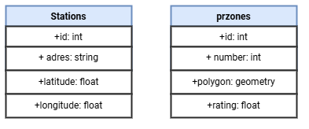

## **WEB-ПРИЛОЖЕНИЕ ДЛЯ ВИЗУАЛИЗАЦИИ ЭЛЕКТРОЗАРЯДНЫХ СТАНЦИЙ И ОПТИМАЛЬНЫХ МЕСТ РАЗМЕЩЕНИЯ.**


Приложение имеет клиент-серверную архитектуру.
### ***Сервер***
Для храенения данных используется база данных PostgreSQL.<br>
<br>
*Где в Stations:*<br>
| Название | Описание |
| -------- | -------- |
| adres    | Адрес электрозаправочной станции |
| latitude | широта |
| longitude | долгота |

*в prsones:*<br>
| Название | Описание |
| -------- | -------- |
| number   | Адрес электрозаправочной станции |
| polygon | хранит в себе координаты для отображения полигона с приоритетными местами застройки |
| rating | приоритетность застройки |

1. *Основной код для работы сервера реализован в `index.js`:*

```javascript
    require('dotenv').config();
const express = require('express');
const sequelize = require('./db');
const modules = require('./models/models');
const cors = require('cors');
const router = require('./router/index');
const errorHandler = require('./middleware/ErrorHandlingMiddleware');

const PORT = process.env.PORT || 5000;

const app = express();
app.use(cors());
app.use(express.json());
app.use('/api', router);

// Обработка ошибок, должна быть последним middleware
app.use(errorHandler);

const start = async () => {
    try {
        await sequelize.authenticate();
        await sequelize.sync();
        app.listen(PORT, () => console.log(`Сервер запущен на порте ${PORT}!`));
    } catch (e) {
        console.log(e);
    }
};

start();
```

2. *Файл для обработки `db.js` подключения к Базе данных PostgreSQL:*

```javascript
const {Sequelize} = require('sequelize')

module.exports = new Sequelize(
    process.env.DB_NAME,
    process.env.DB_USER,
    process.env.DB_PASSWORD,
    {
        dialect: 'postgres',
        host: process.env.DB_HOST,
        port:process.env.DB_PORT
    }
)
```

3. *Для создания БД использовался метод Code First описанный в файле `module.js`:*

```javascript
const sequelize = require('../db')
const {DataTypes} = require('sequelize')

const Station = sequelize.define('station',{
    id: { type: DataTypes.INTEGER, primaryKey: true, autoIncrement: true },
    adress: { type: DataTypes.STRING },
    latitude: { type: DataTypes.FLOAT },
    longitude: { type: DataTypes.FLOAT }, 
 }, {
        timestamps: false // Здесь указываем отключение автоматически создаваемых столбцов
      });

const Zone = sequelize.define('przones', {
    id: {type: DataTypes.INTEGER, primaryKey: true, autoIncrement: true},
    number:{type: DataTypes.INTEGER,},
    polygon: {type: DataTypes.GEOMETRY,},
    rating: {type: DataTypes.FLOAT,}
}, {
    timestamps: false // Здесь указываем отключение автоматически создаваемых столбцов
  });

module.exports = {
    Station,
    Zone
}
```

4. *Файл, который представляет собой контроллер, обрабатывает запросы для работы с ЭЗС в приложении `StationController.js`:*

```javascript
    const {Station} = require('../models/models.js');

class StationController {
    async getAll(req, res) {
        try {
            const stations = await Station.findAll();
            return res.json(stations);
        } catch (error) {
            console.error(error);
            return res.status(500).json({ error: error.message });
        }
    }
}

module.exports = new StationController();
```

5. *Файл, который представляет собой контроллер, обрабатывает запросы для работы с Зонами по приоритетности застройки в приложении `przonesController.js`:*

```javascript
const {Zone} = require('../models/models.js');

class przonesController {
    async getAll(req, res) {
        try {
            const zones = await Zone.findAll();
            return res.json(zones);
        } catch (error) {
            console.error(error);
            return res.status(500).json({ error: error.message });
        }
    }
}

module.exports = new przonesController();
```

6. *Файл-маршрутизатор для работы с объектами ЭЗС `StationRouter.js`:*

```javascript
const Router = require('express')
const StationController = require('../controllers/StationController')

const router = new Router()

router.get('/Station', StationController.getAll)

module.exports = router
```

7. *Файл-маршрутизатор для работы с объектами Зон по приоритетности застройки `przonesRouter.js`:*

```javascript
const Router = require('express')
const przonesController = require('../controllers/przonesController')


const router = new Router()

router.get('/Zone', przonesController.getAll)

module.exports = router
```

8. *Файл для создания маршрута связанного с загрузкой файла в БД ЭЗС через csv-документ использовался этот файл `FileUploadRouter.js`:*

```javascript
const Router = require('express');
const multer = require('multer');
const path = require('path');
const { insertDataFromFile } = require('../addButtonAZS');

const router = Router();

const storage = multer.diskStorage({
  destination: (req, file, cb) => {
    cb(null, 'uploads/'); // Убедитесь, что папка 'uploads' существует
  },
  filename: (req, file, cb) => {
    cb(null, `${Date.now()}_${file.originalname}`);
  }
});

const upload = multer({ storage: storage });

router.post('/upload', upload.single('file'), async (req, res) => {
  console.log(req.file);
  const filePath = path.join(req.file.path);
  
  try {
    await insertDataFromFile(filePath);
    res.status(200).send({ message: 'Файл успешно загружен и обработан.' });
  } catch (error) {
    console.error('Ошибка при обработке файла:', error);
    res.status(500).send({ message: 'Ошибка при обработке файла.' });
  }
});

module.exports = router;
```

10. *Файл для обработки и загрузки ЭЗС в Базу данных PostgreSQL `AddButtonAZS.js`:*

```javascript
const { Client } = require('pg');
const fs = require('fs');
const readline = require('readline');

// Настройки подключения к базе данных
const client = new Client({
    user: 'postgres',
    host: 'localhost',
    database: 'elstation',
    password: 'root',
    port: 5432,
});

async function insertDataFromFile(filePath) {
    try {
        await client.connect();
        console.log("Connected to the database.");
        const fileStream = fs.createReadStream(filePath);
        const rl = readline.createInterface({
            input: fileStream,
            crlfDelay: Infinity
        });

        let lineNumber = 1;
        for await (const line of rl) {
            const data = line.split(',');

            if (data.length < 3) {
                console.error(`Incorrect data format in line ${lineNumber}: ${line}`);
                lineNumber++;
                continue;
            }

            const adress = data[0].replace(/"/g, '').trim();
            const latitude = parseFloat(data[1].replace(/"/g, ''));
            const longitude = parseFloat(data[2].replace(/"/g, ''));

            const insertQuery = `INSERT INTO stations (adress, latitude, longitude) VALUES ($1, $2, $3)`;
            await client.query(insertQuery, [adress, latitude, longitude]);

            console.log(`Inserted Adress: ${adress}, Latitude: ${latitude}, Longitude: ${longitude} into stations`);
            lineNumber++;
        }

        console.log("All data inserted successfully.");
    } catch (err) {
        console.error('Error executing query', err.stack);
    } finally {
        await client.end();
        console.log("Disconnected from the database.");
    }
}

module.exports = {
    insertDataFromFile
};
```

11. *Файл для создания маршрута связанного с загрузкой файла в БД Зон по приоритетности застройки через csv-документ  использовался этот файл `FileUploadRouterZONE.js`:*

```javascript
const Router = require('express');
const multer = require('multer');
const path = require('path');
const { insertDataFromFile } = require('../addButtonZONE');

const router = Router();

const storage = multer.diskStorage({
  destination: (req, file, cb) => {
    cb(null, 'uploads/'); // Убедитесь, что папка 'uploads' существует
  },
  filename: (req, file, cb) => {
    cb(null, `${Date.now()}_${file.originalname}`);
  }
});

const upload = multer({ storage: storage });

router.post('/upload2', upload.single('file'), async (req, res) => {
  console.log(req.file);
  const filePath = path.join(req.file.path);
  
  try {
    await insertDataFromFile(filePath);
    res.status(200).send({ message: 'Файл успешно загружен и обработан.' });
  } catch (error) {
    console.error('Ошибка при обработке файла:', error);
    res.status(500).send({ message: 'Ошибка при обработке файла.' });
  }
});

module.exports = router;
```

12. *Файл для обработки и загрузки Зон по приоритетности застройки в Базу данных PostgreSQL `AddButtonZONE.js`:*

```javascript
const { Client } = require('pg');
const fs = require('fs');
const readline = require('readline');

// Настройки подключения к базе данных
const client = new Client({
  user: 'postgres',
  host: 'localhost',
  database: 'elstation',
  password: 'root',
  port: 5432, // стандартный порт для PostgreSQL
});

async function insertDataFromFile(filePath, tableName) {
  try {
    await client.connect();
    console.log("Connected to the database.");
    
    const fileStream = fs.createReadStream(filePath);
    const rl = readline.createInterface({
      input: fileStream,
      crlfDelay: Infinity
    });

    for await (const line of rl) {
      // Using a regex to split the line while keeping quoted strings intact
      const data = line.match(/(".*?"|[^",\s]+)(?=\s*,|\s*$)/g);

      if (data.length < 3) {
        console.error(`Incorrect data format in line: ${line}`);
        continue;
      }

      const id = parseInt(data[0], 10); // Parse id as a number
      const polygonWKT = data[1].replace(/"/g, '').trim(); // Remove quotes and trim whitespace
      const rating = parseFloat(data[2]); // Parse ratings as a float

      const insertQuery = `INSERT INTO przones (number, polygon, rating) VALUES ($1, ST_GeomFromText($2, 4326), $3)`;
      await client.query(insertQuery, [id, polygonWKT, rating]);

      console.log(`Inserted ID: ${id}, Polygon: ${polygonWKT}, Rating: ${rating} into ${tableName}`);
    }

    console.log("All data inserted successfully.");
  } catch (err) {
    console.error('Error executing query', err.stack);
  } finally {
    await client.end();
    console.log("Disconnected from the database.");
  }
}

module.exports = {
  insertDataFromFile
};
```

10.*Для объединения всех маршрутов использовался основной маршрутизатор файл `index.js`:*

```javascript
const Router = require('express');
const router = new Router();
const StationRouter = require('./StationRouter');
const przonesRouter = require('./przonesRouter');
const FileUploadRouter = require('./FileUploadRouter');
const FileUploadRouterZONE = require('./FileUploadRouterZONE');

router.use(StationRouter);
router.use(przonesRouter);
router.use(FileUploadRouter); // Добавьте строку для использования маршрута загрузки файлов
router.use(FileUploadRouterZONE);

module.exports = router;
```


### ***Клиент***
1. *Основной код для визуализации Яндекс карты реализован в `App.js` для этого необходим Api ключ для Яндекс карты:*

```javascript
    const initializeMap = () => {
      if (!window.ymaps) {
        const script = document.createElement('script');
        script.src = `https://api-maps.yandex.ru/2.1/?apikey=${apiKey}&lang=ru_RU`;
        script.onload = () => {
          if (mapInitiated) return;

          const mapContainer = document.getElementById('map');
          if (mapContainer) {
            mapContainer.innerHTML = '';

            window.ymaps.ready(() => {
              mapRef.current = new window.ymaps.Map("map", {
                center: [55.76, 37.64],
                zoom: 10,
                controls: []
              });

              setMapInitiated(true);
            });
          }
        };
    };
```
2. *Функция `handleZoneButtonClick1` отсылает нас на файл с названием `zoneHandler.js`, в котором релезованы следующие методы:*
   1. *Кнопка при нажатии на которую будут отображаться полигоны:*
   
```javascript
const handleZoneButtonClick = (mapRef, zoneRectangles, setZoneRectangles, objectsAdded, setObjectsAdded) => {
    if (!objectsAdded) {
      fetchZoneData(mapRef, setZoneRectangles);
      setObjectsAdded(true);
    } else {
      clearZones(mapRef, zoneRectangles, setZoneRectangles);
      setObjectsAdded(false);
    }
  };
  ```
  2. *Метод очищения карты при повторном нажатии кнопки:*
   
```javascript
const clearZones = (mapRef, zoneRectangles, setZoneRectangles) => {
    if (mapRef.current) {
      zoneRectangles.forEach((rectangle) => {
        mapRef.current.geoObjects.remove(rectangle);
      });
      setZoneRectangles([]);
    }
  };
```
   3. *Метод получения данных с сервера:*
   
```javascript
const fetchZoneData = (mapRef, setZoneRectangles) => {
    fetch('http://localhost:5000/api/Zone')
      .then(response => response.json())
      .then(data => {
        const polygonLayers = data.map(item => {
          const { polygon, rating } = item;
          if (polygon && polygon.coordinates) {
            return processPolygon(polygon.coordinates, rating);
          } else {
            console.error('Некорректные данные полигона:', item);
            return null;
          }
        }).filter(layer => layer !== null);
  
        if (mapRef.current) {
          const newZoneRectangles = [];
          polygonLayers.forEach(layer => {
            mapRef.current.geoObjects.add(layer);
            newZoneRectangles.push(layer);
          });
          setZoneRectangles(newZoneRectangles);
        }
      })
      .catch(error => {
        console.error('Ошибка при получении данных полигонов:', error);
      });
  };
```
   4. *Метод отображения полигонов на Яндекс Карте:*
   
```javascript
  const processPolygon = (coordinates, rating) => {
    const color = getRatingColor(rating);
    try {
      return new window.ymaps.GeoObject({
        geometry: {
          type: 'Polygon',
          coordinates: coordinates,
        },
        properties: {
          hintContent: `Рейтинг: ${rating}`,
          balloonContent: `Рейтинг: ${rating}`,
        },
      }, {
        fillColor: color,
        strokeColor: '#0000ff',
        opacity: 0.5,
      });
    } catch (error) {
      console.error('Ошибка при создании полигона:', error);
      return null;
    }
  };
```
   5. *Метод для определения цвета полигона исходя из значения приоритетности:*
   
```javascript
  const getRatingColor = (rating) => {
    if (rating === 0) {
      return 'rgba(255, 0, 0, 0.5)'; // Красный цвет для рейтинга равному 0
    } else if (rating > 0 && rating < 0.5) {
      return 'rgba(255, 255, 0, 0.5)'; // Желтый цвет для рейтинга от 0 до 0,5
    } else {
      return 'rgba(0, 255, 0, 0.5)'; // Зеленый цвет для рейтинга больше 0,5
    }
  };
```
2. *Функция `handleStationeButtonClick1` отсылает нас на файл с названием `StationHandler.js`, в котором релезованы следующие методы:*
    1. *Кнопка при нажатии на которую будут отображаться электрозарядные станции:*
   
```javascript
const handleStationButtonClick = (mapRef, stationPlacemarks) => {
    if (stationPlacemarks.current.length === 0) {
      fetchStationData(mapRef, stationPlacemarks);
    } else {
      clearStations(mapRef, stationPlacemarks);
    }
  };
  ```
  2. *Метод очищения карты при повторном нажатии кнопки:*
   
```javascript
const clearStations = (mapRef, objectsAdded1) => {
    objectsAdded1.current.forEach((placemark) => {
      mapRef.current.geoObjects.remove(placemark);
    });
    objectsAdded1.current = [];
  };
```
   3. *Метод получения данных с сервера и отображения меток электрозарядных станций на Яндекс карте:*
   
```javascript
const fetchStationData = (mapRef, objectsAdded1) => {
    fetch('http://localhost:5000/api/Station')
      .then(response => response.json())
      .then(data => {
        data.forEach(coord => {
          const placemark = new window.ymaps.Placemark(
            [coord.latitude, coord.longitude],
            { hintContent: coord.address }
          );
  
          objectsAdded1.current.push(placemark);
          mapRef.current.geoObjects.add(placemark);
        });
      })
      .catch(error => {
        console.error('Error fetching station data:', error);
      });
  };
```
3. *Теги `<input/>` необходимы для добавления в базу данных PostgreSQL с помощью файла формата .csv данных для электрозарядных станций и приорететных мест застройки:*
   1. *Функция `handleFileInputChange` и `handleFileInputChange2` отсылает нас к файлу `addFiles.js` в котором реалезован код отправки загруженного файла по указенному URL на сервер:*
        1. *Отправление файла с электрозаправочными станциями:*
   
```javascript
const handleFileInputChange = async (event) => {
    const file = event.target.files[0];
    const formData = new FormData();
    formData.append('file', file);
  
    try {
        const response = await axios.post   ('http://localhost:5000/api/upload', formData, {
            headers: { 'Content-Type': 'multipart/form-data' }
            });
    } catch (error) {
            console.error('Error uploading file:', error);
    }
};
```
   1. *Отправление файла с приорететными местами застройки:*
   
```javascript
const handleFileInputChange2 = async (event) => {
    const file = event.target.files[0];
    const formData = new FormData();
    formData.append('file', file);
  
    try {
      const response = await axios.post('http://localhost:5000/api/upload2', formData, {
        headers: { 'Content-Type': 'multipart/form-data' }
      });
      console.log(response.data);
    } catch (error) {
      console.error('Error uploading file:', error);
    }
  };
```
